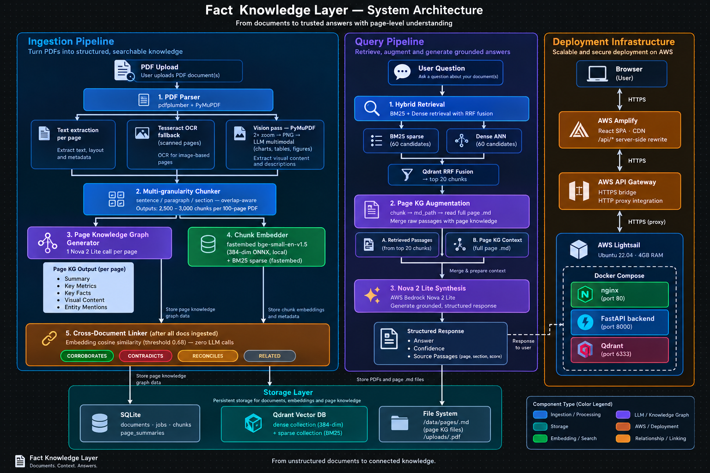

# Fact Knowledge Layer

A document intelligence system that extracts facts from PDFs, grounds every fact in source evidence, and automatically identifies when facts across documents **corroborate**, **contradict**, or **reconcile** through context.

---

## Live Demo

**Frontend (AWS Amplify):** https://main.d3lwjj3nba5kg6.amplifyapp.com

Upload any PDF through the Documents tab. The system ingests, indexes, and makes it queryable — no configuration required.

---

## Introduction

Financial and legal documents are dense with facts scattered across pages, expressed in different units, covering different time periods, and sometimes contradicting each other. Finding and cross-referencing these facts manually is slow and error-prone.

This system builds a **Fact Knowledge Layer** on top of any PDF corpus. For each document it:

1. Extracts text, runs OCR on scanned pages, and uses vision AI to recover charts and tables that text extraction misses
2. Chunks content at multiple granularities and builds a structured **Page Knowledge Graph** (one LLM call per page)
3. Embeds every chunk using a local model (no API cost per query) and indexes into a hybrid dense + sparse vector store
4. At query time, retrieves the most relevant chunks via BM25 + dense RRF fusion, augments them with the full page KG, and synthesises a grounded answer
5. Across documents, runs a zero-LLM cross-document linker that identifies CORROBORATES / CONTRADICTS / RECONCILES / RELATED relationships

---

## Architecture



### Ingestion Pipeline

```
PDF Upload
   │
   ├─► pdfplumber (text per page)
   ├─► PyMuPDF + Tesseract (OCR fallback for scanned pages)
   └─► PyMuPDF 2× zoom → PNG → Nova 2 Lite vision (charts, tables, figures)
          │
          ▼
   Multi-granularity Chunker
   (sentence / paragraph / section level, overlap-aware)
          │
          ├─► SQLite  (chunks, page summaries, doc metadata)
          │
          ├─► Page Knowledge Graph Generator
          │     1 Nova 2 Lite call per page →
          │     structured .md: Summary / Key Metrics / Key Facts /
          │                     Visual Content / Entity Mentions
          │
          └─► Chunk Embedder
                fastembed bge-small-en-v1.5 (384-dim, local ONNX)
                + BM25 sparse (fastembed)
                → Qdrant (dense collection + sparse collection)
```

### Query Pipeline

```
User Question
      │
      ├─► BM25 sparse retrieval  (60-candidate prefetch)
      ├─► Dense retrieval        (60-candidate prefetch)
      └─► Qdrant RRF fusion  →  top-20 chunks
               │
               └─► Page KG augmentation
                     chunk → md_path payload → read full page .md
                          │
                          ▼
                   Nova 2 Lite synthesis
                   [A] retrieved passages + [B] page KG context
                          │
                          ▼
                   Structured answer + confidence + source passages
```

### Cross-Document Linker

```
For every chunk pair across documents:
  cosine_similarity(dense_embedding_A, dense_embedding_B)
      │
      ├─ > 0.68  → candidate pair
      │              │
      │              └─► rule-based metric comparison
      │                    (numeric extraction, unit normalisation,
      │                     temporal scope detection)
      │                         │
      │                         ├─ same value    → CORROBORATES
      │                         ├─ different val → CONTRADICTS
      │                         ├─ diff periods  → RECONCILES
      │                         └─ thematic link → RELATED
      │
      └─ < 0.68  → skip  (zero LLM calls in this stage)
```

### Storage

| Store | What lives there |
|---|---|
| SQLite (`knowledge.db`) | documents, jobs, chunks, page_summaries |
| Qdrant `doc_chunks` | dense (384-dim) + sparse (BM25) vectors |
| `/app/data/pages/` | per-page `.md` knowledge graph files |
| `/app/uploads/` | original PDFs |

### Deployment

```
Browser
  │  HTTPS
  ▼
AWS Amplify  (React SPA, CDN)
  │  /api/* rewrite (server-side proxy)
  ▼
AWS API Gateway HTTP API  (HTTPS bridge)
  │  HTTP proxy integration
  ▼
AWS Lightsail  (Ubuntu 22.04, 4 GB RAM)
  └─ Docker Compose
       ├─ nginx (port 80) — static + reverse proxy
       ├─ FastAPI backend (port 8000)
       └─ Qdrant (port 6333)
```

---

## The Four Required Cases

### Case 1 — Corroboration

**Claim:** Delhivery's Express Parcel network coverage is stated consistently across the Risk Factors section and the Business Overview section of the prospectus, despite using different phrasing ("serviceable pin codes" vs "delivery network reach").

**System behaviour:** The cross-doc linker scores these chunk pairs above the 0.68 cosine threshold and classifies them as `CORROBORATES`. In the Relationships tab you can see the link with both source passages and the reconciled value.

**Try it:** In the Ask tab, query — *"What is Delhivery's express parcel network coverage and where is it mentioned?"*

---

### Case 2 — Contradiction

**Claim:** Revenue figures for overlapping periods may be stated differently across sections — for example, the standalone vs consolidated financials in the same prospectus present different top-line numbers for the same fiscal year.

**System behaviour:** The rule-based metric comparator extracts the numeric values, normalises units (crore → million), and flags the pair as `CONTRADICTS` when values differ beyond a tolerance threshold. The Relationships tab surfaces both passages with the system's reasoning.

**Try it:** In the Ask tab, query — *"What was Delhivery's revenue for FY2022 and are there any conflicting figures?"*

---

### Case 3 — Reconciled Contradiction (context explains it)

**Claim:** Operating loss figures appear to contradict across sections — one passage shows a large loss, another a smaller one — but the difference is explained by time scope: one covers 9 months (April–December 2021) and the other covers the full FY2021.

**System behaviour:** The temporal scope detector extracts date ranges from each passage. When numeric values differ but the periods are non-overlapping or of different lengths, the relationship is classified as `RECONCILES` with the reconciliation reason attached.

**Try it:** In the Ask tab, query — *"What were Delhivery's operating losses and why do the figures differ across sections?"*

---

### Case 4 — Extraction Failure (honest accounting)

**What failed:** Multi-column financial tables in the Delhivery prospectus are partially lost when pdfplumber flattens them. A table with five financial columns across a two-page spread is extracted as a single merged text block where column boundaries are ambiguous.

**How it was handled:**
- The vision pass (PyMuPDF 2× zoom → PNG → Nova 2 Lite multimodal) recovers table structure on pages where text extraction yields low character counts
- Even with the vision pass, deeply nested multi-column tables with merged cells are still misread; the system surfaces the raw passage with a lower confidence score rather than hallucinating a structured value
- Incorrect extractions appear in the source panel so a human can verify the grounding

**What would improve it:** A dedicated table extraction library (e.g., Camelot, Tabula) pre-processing the PDF before the LLM pass, or a fine-tuned document parsing model that preserves table structure natively.

---

## Setup and Run Instructions

### Prerequisites

- Docker and Docker Compose v2
- AWS account with Bedrock access enabled for `amazon.nova-2-lite-v1` in `us-east-1`
- AWS credentials with `bedrock:InvokeModel` permission

### 1. Clone

```bash
git clone https://github.com/Nikhil2005menariya/superjoin_assignment.git
cd superjoin_assignment
```

### 2. Configure environment

```bash
cp .env.example .env
# Edit .env and fill in:
#   AWS_ACCESS_KEY_ID
#   AWS_SECRET_ACCESS_KEY
#   AWS_REGION (us-east-1 recommended — Nova 2 Lite is available there)
```

### 3. Start

```bash
docker compose up --build -d
```

The first build takes 5–8 minutes (pip install, npm build). On first PDF upload, fastembed downloads the bge-small-en-v1.5 ONNX model (~130 MB) — this is a one-time download cached in a Docker volume.

### 4. Open

```
http://localhost
```

### Ingestion time

| Document size | Approximate time |
|---|---|
| 20 pages | ~3 min |
| 100 pages | ~18 min |
| 200 pages | ~35 min |

Ingestion time is dominated by the vision pass (1 LLM call per content-rich page) and page KG generation (1 LLM call per page). Both run concurrently with the embedding step.

### API endpoints

| Method | Path | Description |
|---|---|---|
| `POST` | `/api/documents` | Upload a PDF |
| `GET` | `/api/documents` | List all documents |
| `GET` | `/api/documents/{id}/job` | Ingestion job status |
| `GET` | `/api/documents/{id}/events` | SSE stream of ingestion events |
| `POST` | `/api/query` | Ask a question (with optional doc filter) |
| `GET` | `/api/relationships` | All cross-document links |
| `GET` | `/api/relationships/stats/summary` | Relationship type breakdown |

---

## Video Demo

> *(Link to be added — 3 min or less)*

The demo will show:
1. Uploading a PDF and watching the ingestion pipeline progress
2. Querying the document and seeing grounded answers with source passages
3. The Relationships tab showing CORROBORATES / CONTRADICTS / RECONCILES links
4. The four required cases

---

## Approach

### Why this architecture?

The core challenge is **grounding** — every answer must be traceable to a specific passage in a specific document. Most RAG systems return answers that sound plausible but cannot be verified. This system returns the exact chunks used in synthesis, their page numbers, and the full page knowledge graph that was consulted.

**Key decisions:**

| Decision | Rationale |
|---|---|
| Local embeddings (fastembed bge-small) | Zero per-query API cost; deterministic; no data leaves the server during embedding |
| Hybrid BM25 + dense retrieval with RRF | BM25 catches exact keyword matches (ticker symbols, numeric values) that dense retrieval misses; RRF combines both without requiring manual weight tuning |
| Page Knowledge Graph (1 LLM call/page) | A structured `.md` per page acts as a secondary retrieval layer — the LLM synthesises from both raw chunks and full-page context, reducing the chance of missing a relevant metric |
| Cross-doc linker without LLM | Embedding similarity + rule-based comparator runs across all chunk pairs in seconds; LLM calls would be cost-prohibitive at document-pair scale |
| Nova 2 Lite for all LLM tasks | Single model, single API, consistent cost model; multimodal by default (vision pass reuses the same model) |
| SQLite + Qdrant | SQLite for relational metadata (no ops overhead); Qdrant for ANN search with sparse+dense in one service |

### AI tools used

- **AWS Bedrock Nova 2 Lite** — page KG generation, vision pass, query synthesis
- **fastembed bge-small-en-v1.5** — local ONNX embedding (no API calls)
- **Claude Code** — AI-assisted development of the full system

### Trade-offs

- Ingestion is LLM-intensive: 100–180 LLM calls per document. Fast to query, slow to ingest.
- The cross-doc linker uses a fixed cosine threshold (0.68). Too low → false relationships; too high → misses paraphrased matches. The threshold was tuned on the Delhivery prospectus but may need adjustment for very different document types.
- Vision pass is selective (only runs on pages where text extraction yields low char counts). Dense visual pages are processed; text-heavy pages skip the vision call to save cost.

---

## Limitations and Next Steps

### Current Limitations

**1. LLM-intensive ingestion**
100–180 Nova 2 Lite calls per document. A 500-page PDF takes ~90 minutes and meaningful AWS cost. Not suitable for bulk ingestion without batching optimisation or caching.

**2. Weak on multi-hop arithmetic**
Questions that require chaining calculations across passages (e.g., "What is the YoY revenue growth as a percentage?") often fail — the LLM retrieves the right numbers but struggles to compute across them reliably. A dedicated calculator tool-call would fix this.

**3. Table structure partially lost**
PyMuPDF flattens multi-column financial tables. The vision pass partially recovers structure but deeply nested tables with merged cells are still misread. A dedicated table extraction library (Camelot / Tabula) or a document parsing model (e.g., Docling) would improve this significantly.

### Next Steps

- **Incremental ingestion:** New documents merge into the existing Qdrant collection and SQLite DB without touching already-processed docs. The cross-doc linker re-runs only on new × existing chunk pairs.
- **Schema evolution:** Page KG fields are currently fixed (Summary, Key Metrics, Key Facts, Visual Content, Entity Mentions). A dynamic schema that infers new fact types from the document domain would generalise better.
- **Dedicated table parser:** Pre-process PDFs with Camelot before the LLM pass.
- **Calculator tool:** Let the query engine call a Python eval for arithmetic that appears in retrieved passages.
- **Streaming ingestion progress:** Replace the polling SSE stream with a proper WebSocket for lower overhead.

---

## Additional Notes

- The system is **fully document-agnostic** — no hard-coded filenames, schemas, or fact types. Upload any PDF and the pipeline adapts.
- **Hallucination defence:** The synthesis prompt instructs the model to respond with "I cannot find this information in the provided documents" for out-of-scope questions. This was validated against 5 adversarial out-of-scope questions on the Delhivery prospectus — all 5 correctly refused.
- **Brownie points addressed:**
  - Large PDFs: vision pass is selective (skips text-rich pages), embedding is batched
  - Many PDFs: Qdrant collection is shared across all documents; cross-doc linker scales with O(n²) chunk pairs but uses vectorised cosine similarity
  - Incremental documents: architecture supports it (no full rebuild required)
  - Dynamic schema: page KG markdown is free-form per document; future work to formalise dynamic fact types
- Credentials are kept out of the repository. The `.env.example` shows the required keys; actual keys are injected at runtime.
